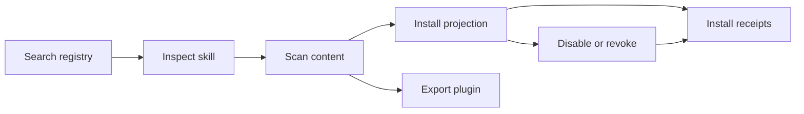

# HELM Skill Packs Flow Catalog

HELM Skill Packs are signed, scoped procedural packages for agents. A skill can guide behavior, but it cannot grant tool permissions or execution authority.

## Audience

Use this page if you are installing, exporting, reviewing, or disabling HELM-managed skill packs for Codex, Claude Code, or another supported agent surface.

## Outcome

After reading this page, you should know which CLI flows exist, what receipt each flow emits, and where the skill boundary prevents procedural guidance from becoming execution authority.

## Flow

## Source Truth

- Skill runtime commands: `core/cmd/helm-ai-kernel/skills_cmd.go`
- Skill runtime packages: `core/pkg/skills/`
- Skill registry: `registry/skills/`
- Skill policy fixtures: `policies/skills/`
- Skill docs: `docs/skills/`

## OSS Flows

### Search

`helm-ai-kernel skills search --json`

Loads the first-party skill registry and returns skills as `verified`, `experimental`, `blocked`, or `external`.

### Inspect

`helm-ai-kernel skills inspect helm/repo-auditor --json`

Shows manifest, requested projections, and the authority boundary: this skill does not grant tool permissions.

### Scan

`helm-ai-kernel skills scan <path_or_ref> --json`

Computes `skill_content_hash`, scans `SKILL.md`, metadata, scripts, symlinks, and MCP/tool requests, then emits `SKILL_SCAN_ATTESTATION`.

### Repo-Scoped Install

`helm-ai-kernel skills install helm/repo-auditor --agent codex --scope repo`

Runs scan, writes managed projection files atomically, and emits `SKILL_INSTALL_RECEIPT` plus `SKILL_PROJECTION_RECEIPT`.

### User Or Global Install

`helm-ai-kernel skills install helm/repo-auditor --agent codex --scope user`

Returns `ESCALATE` by default and writes no projection files.

### Export Codex Plugin

`helm-ai-kernel skills export helm/repo-auditor --format codex-plugin --output ./dist/repo-auditor`

Writes `.codex-plugin/plugin.json`, bundled skill files, pending/quarantined MCP metadata, and off-by-default hooks.

### Marketplace

`helm-ai-kernel skills marketplace init --scope repo`

Creates `.agents/plugins/marketplace.json`.

`helm-ai-kernel skills marketplace add <plugin_path>`

Adds only plugins inside the repo root and records policy/source hashes.

### Disable And Revoke

`helm-ai-kernel skills disable <skill_ref>`

Marks a HELM-managed install disabled and emits `SKILL_DISABLE_RECEIPT`.

`helm-ai-kernel skills revoke <skill_ref>`

Removes managed projection files, updates install state, and emits `SKILL_REVOKE_RECEIPT`.

## Negative Flows

- Policy bypass attempt -> `DENY`.
- Secret exfiltration attempt -> `DENY`.
- Global install request -> `ESCALATE`.
- MCP side-effect auto-enable -> `ESCALATE`.
- Plugin hook auto-approval -> `DENY`.
- Symlink escape -> `DENY`.
- Opaque binary payload -> `DENY` until provenance is available.

## Completion Gaps

Deferred: remote GitHub skill fetch, key-backed signature verification, full plugin marketplace e2e, and Enterprise global rollout approvals remain outside this MVP slice.

## Troubleshooting

| Symptom | First check |
| --- | --- |
| A skill appears to grant tool access | Re-check the policy bundle; skills guide behavior but do not grant permissions. |
| Repo-scoped install fails | Run `skills scan` and inspect symlink, script, and MCP metadata findings. |
| User or global install escalates | This is expected by default until Enterprise rollout approval exists. |
| Plugin export includes MCP metadata | Confirm pending or quarantined MCP metadata remains off by default. |
