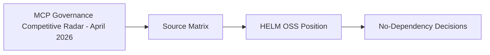

# MCP Governance Competitive Radar - April 2026

## Audience

Internal maintainers using this private strategy note to compare MCP governance signals against HELM OSS scope.

## Outcome

After this page you should know what this surface is for, which source files own the behavior, which public route or adjacent page to use next, and which validation command to run before changing the claim.

## Source Truth

- Public route: `helm-oss/strategy/mcp-governance-competitive-radar-2026-04`
- Source document: `helm-oss/docs/strategy/mcp-governance-competitive-radar-2026-04.md`
- Public manifest: `helm-oss/docs/public-docs.manifest.json`
- Source inventory: `helm-oss/docs/source-inventory.manifest.json`
- Validation: `make docs-coverage`, `make docs-truth`, and `npm run coverage:inventory` from `docs-platform`

Do not expand this page with unsupported product, SDK, deployment, compliance, or integration claims unless the inventory manifest points to code, schemas, tests, examples, or an owner doc that proves the claim.

## Troubleshooting

| Symptom | First check |
| --- | --- |
| The public page and source behavior disagree | Treat the source path in `Source Truth` as canonical, then update the docs and source-inventory row in the same change. |
| A link or route is missing from the docs website | Check `docs/public-docs.manifest.json`, `llms.txt`, search, and the per-page Markdown export before changing navigation. |
| A claim is not backed by code or tests | Remove the claim or add the missing code, example, schema, or validation command before publishing. |

## Diagram

This scheme maps the main sections of MCP Governance Competitive Radar - April 2026 in reading order.

This page records the April 2026 competitive scan for HELM OSS MCP governance. It distinguishes verified product signals from HELM's retained OSS differentiation.

## Source Matrix

| Linear | Source | Verification | HELM response |
| --- | --- | --- | --- |
| `MIN-204` | [Microsoft Agent Governance Toolkit](https://github.com/microsoft/agent-governance-toolkit) | Repository exists under `microsoft`; public docs position AGT around runtime policy, identity, sandboxing, and OWASP Agentic coverage | Keep AGT as coexistence surface; HELM remains the receipt-bearing boundary and evidence-pack exporter |
| `MIN-211` | [SurePath AI MCP Policy Controls](https://www.prnewswire.com/news-releases/surepath-ai-advances-real-time-model-context-protocol-mcp-policy-controls-to-govern-ai-actions-302709875.html) | Company release dated March 12, 2026 describes real-time MCP server/tool controls before execution | Emphasize HELM's local-first kernel, ProofGraph, and offline evidence verification |
| `MIN-251` | [Invariant Gateway Guardrails](https://explorer.invariantlabs.ai/docs/guardrails/gateway/) | Official docs describe an LLM and MCP proxy that evaluates guardrails before and after requests | Position HELM as deterministic execution governance rather than content guardrail proxying |
| `MIN-228` | [PolicyLayer Intercept](https://policylayer.com/docs/reference/policy-controls) | Official docs describe an open-source MCP proxy with fail-closed policy evaluation and JSONL audit logs | Keep fail-closed MCP behavior, but differentiate with signed receipts, ProofGraph, reference packs, and artifact verification |
| `MIN-270` | [asqav SDK](https://pypi.org/project/asqav/) and [NIST FIPS 204](https://csrc.nist.gov/pubs/fips/204/final) | PyPI package describes ML-DSA signed action records; NIST FIPS 204 is the ML-DSA standard | Do not add a dependency; describe HELM's current signatures as classical and leave ML-DSA/PQC as optional roadmap work |
| `MIN-218` | [Anthropic code execution tool](https://docs.anthropic.com/en/docs/agents-and-tools/tool-use/code-execution-tool) | Public Anthropic docs verify sandboxed API code execution and workspace scoping; no primary Anthropic page for "Claude Managed Agents GA" was found in this pass | Treat as adjacent positioning only; do not claim Managed Agents parity without a primary source |
| `MIN-215` | [Agentic AI Foundation events program](https://events.linuxfoundation.org/2026/04/17/agentic-ai-foundation-announces-global-2026-events-program-anchored-by-agntcon-mcpcon-north-america-and-europe/) and [MCP roadmap](https://modelcontextprotocol.io/development/roadmap) | Linux Foundation event source verifies AAIF/MCPCon activity; MCP roadmap records Working Groups, SEPs, contributor ladder, and enterprise authorization priorities | Track SEPs and WG output; publish compatibility notes only when a stable spec or extension lands |

## HELM OSS Position

HELM OSS should avoid a "proxy-only" story. The competitive field increasingly validates MCP interception, fail-closed policy, tool-level controls, and structured audit events. HELM's retained wedge is the combination of:

- deterministic pre-action governance at the execution boundary;
- signed receipts and ProofGraph evidence rather than log-only audit trails;
- offline evidence-pack verification and reference-pack alignment for regulated deployments;
- provider-neutral deployment that can sit below framework-local or vendor-managed controls;
- additive MCP OAuth resource and per-tool scope enforcement.

## No-Dependency Decisions

No competitor SDK is imported into HELM OSS from this scan. The verified response is documentation plus the first-party MCP OAuth resource/scope implementation. PQC/ML-DSA remains a roadmap option because adopting it would change key-management, release-signing, and verification policy across the evidence stack.
