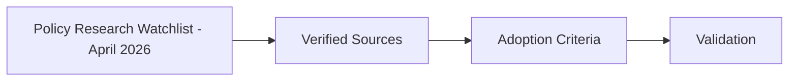

# Policy Research Watchlist - April 2026

## Audience

Internal maintainers using this private strategy note to track policy-research inputs that may inform future HELM OSS roadmap work.

## Outcome

After this page you should know what this surface is for, which source files own the behavior, which public route or adjacent page to use next, and which validation command to run before changing the claim.

## Source Truth

- Public route: `helm-oss/strategy/policy-research-watchlist-2026-04`
- Source document: `helm-oss/docs/strategy/policy-research-watchlist-2026-04.md`
- Public manifest: `helm-oss/docs/public-docs.manifest.json`
- Source inventory: `helm-oss/docs/source-inventory.manifest.json`
- Validation: `make docs-coverage`, `make docs-truth`, and `npm run coverage:inventory` from `docs-platform`

Do not expand this page with unsupported product, SDK, deployment, compliance, or integration claims unless the inventory manifest points to code, schemas, tests, examples, or an owner doc that proves the claim.

## Troubleshooting

| Symptom | First check |
| --- | --- |
| The public page and source behavior disagree | Treat the source path in `Source Truth` as canonical, then update the docs and source-inventory row in the same change. |
| A link or route is missing from the docs website | Check `docs/public-docs.manifest.json`, `llms.txt`, search, and the per-page Markdown export before changing navigation. |
| A claim is not backed by code or tests | Remove the claim or add the missing code, example, schema, or validation command before publishing. |

## Diagram

This scheme maps the main sections of Policy Research Watchlist - April 2026 in reading order.

This page records source verification and implementation decisions for April 2026 HELM OSS research radar items. Research items close when the source is verified and a clear adopt, watch, or no-go decision is recorded.

## Verified Sources

| Linear | Source | Verification | Decision |
| --- | --- | --- | --- |
| `MIN-195` | [AgentSpec: Customizable Runtime Enforcement for Safe and Reliable LLM Agents](https://arxiv.org/abs/2503.18666) | arXiv record exists; paper was submitted March 24, 2025 and later revised; accepted by ICSE 2026 per arXiv metadata | Watch for policy-authoring UX patterns; do not introduce a second DSL into HELM OSS |
| `MIN-196` | [Zero-Knowledge Audit for Internet of Agents](https://arxiv.org/abs/2512.14737) and [Engineering Trustworthy MLOps with ZK Proofs](https://arxiv.org/abs/2505.20136) | Both arXiv records exist and align with privacy-preserving verification / ZK ML operations | Keep `core/pkg/zkgov` as the exploration surface; no default ZK proof requirement for evidence packs yet |
| `MIN-199` | [Runtime Governance for AI Agents: Policies on Paths](https://arxiv.org/html/2603.16586v1) | arXiv HTML exists; paper frames policies as deterministic functions over execution paths and organizational state | Map to HELM session history, ProofGraph, and policy composition; no new formal language in this cycle |
| `MIN-264` | [Before the Tool Call: Deterministic Pre-Action Authorization for Autonomous AI Agents](https://arxiv.org/abs/2603.20953) | arXiv record exists; source describes Open Agent Passport and pre-action authorization | HELM already implements the reference-monitor pattern; document as compatibility/positioning, not a new runtime dependency |
| `MIN-273` | [OpenPort Protocol](https://arxiv.org/abs/2602.20196) | arXiv record exists; source describes authorization-dependent discovery, reason codes, scoped permissions, and fail-closed behavior | Track MAPL/grammar ideas; prefer compatibility notes and negative tests before schema changes |
| `MIN-274` | [An AI Agent Execution Environment to Safeguard User Data](https://arxiv.org/abs/2604.19657) | arXiv record exists; source describes GAAP and deterministic confidentiality enforcement for private user data | Explore confidentiality-preserving evidence envelopes; no default private-data runtime added |
| `MIN-279` | [SafePred](https://arxiv.org/abs/2602.01725) | arXiv record exists; source describes predictive guardrails for computer-using agents via world models | Prototype only behind explicit policy flags; no model-dependent guardrail in the default path |
| `MIN-237` | [AgentWatcher](https://arxiv.org/abs/2604.01194v1) | arXiv record exists; source describes rule-based prompt-injection monitoring | See `docs/security/prompt-injection-watchlist-2026-04.md` |
| `MIN-238` | [ICON](https://arxiv.org/abs/2602.20708v1) | arXiv record exists; source describes inference-time indirect prompt-injection correction | See `docs/security/prompt-injection-watchlist-2026-04.md` |

## Adoption Criteria

Move a watchlist item into implementation only when it satisfies all of these:

- it preserves HELM's deterministic evidence model or wraps model-assisted decisions in replayable evidence;
- it can be gated by policy without weakening current Guardian decisions;
- it has local fixtures or negative tests that fail before implementation and pass after;
- it does not require paid external services for default verification;
- it clarifies rather than dilutes the OSS kernel boundary.
