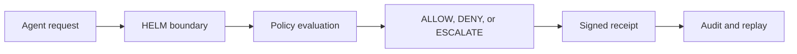

# AI Agent Side-Effect Governance

Agents propose tool calls; something has to decide which of them may run. HELM AI Kernel is that decision point: a fail-closed boundary that evaluates every consequential tool call against policy before the side effect happens, not after.

Each proposal passes through the guardian pipeline and receives exactly one canonical verdict: ALLOW, DENY, or ESCALATE. Unknown tools and unmatched policy default to deny. ESCALATE stops the action and routes it to a human approver instead of guessing.

Every verdict is recorded as an Ed25519-signed receipt over a JCS (RFC 8785) canonical form, so the decision, the policy hash, and the requesting identity can be replayed and verified offline long after the agent session ends. Orchestration decides what to attempt; HELM decides what may execute.

## Governance Path



```bash
git clone https://github.com/Mindburn-Labs/helm-ai-kernel.git
cd helm-ai-kernel
make build
bash scripts/launch/demo-local.sh
```

## Source Truth

- [Quickstart](../QUICKSTART.md)
- [Execution security model](../EXECUTION_SECURITY_MODEL.md)
- [MCP integration](../INTEGRATIONS/mcp.md)
- [Verification](../VERIFICATION.md)
