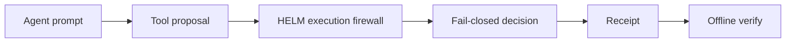

# AI Agent Execution Firewall

HELM AI Kernel documents this search intent with a local, source-backed proof path.

## Security Boundary



```bash
git clone https://github.com/Mindburn-Labs/helm-ai-kernel.git
cd helm-ai-kernel
make build
bash scripts/launch/demo-proof.sh
```

## Source Truth

- [Quickstart](../QUICKSTART.md)
- [Execution security model](../EXECUTION_SECURITY_MODEL.md)
- [MCP integration](../INTEGRATIONS/mcp.md)
- [Verification](../VERIFICATION.md)
