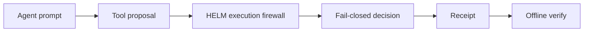

# AI Agent Execution Firewall

Prompt injection, poisoned context, and compromised tools all end the same way: an agent attempting an action it should never run. An execution firewall assumes the model can be manipulated and enforces the boundary at the only reliable place, the moment a side effect is about to leave the process.

HELM AI Kernel interposes between the agent and real systems. Every consequential proposal is checked against policy, identity, and egress rules in a fail-closed pipeline: anything unknown or unapproved is denied by default, and high-risk actions escalate to a human. Network egress is allowlist-only; an empty allowlist means deny-all.

The result of every decision is a signed receipt you can verify offline. If an attack made it through, the receipt chain shows exactly what ran, under which policy, and why.

## Security Boundary



```bash
git clone https://github.com/Mindburn-Labs/helm-ai-kernel.git
cd helm-ai-kernel
make build
bash scripts/launch/demo-proof.sh
```

## Source Truth

- [Quickstart](../QUICKSTART.md)
- [Execution security model](../EXECUTION_SECURITY_MODEL.md)
- [MCP integration](../INTEGRATIONS/mcp.md)
- [Verification](../VERIFICATION.md)
