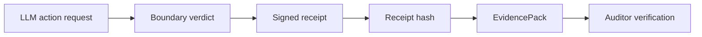

# Signed Receipts for AI Agent Actions

Logs answer "what did we write down"; receipts answer "what actually happened, and can someone else check?" HELM AI Kernel signs every boundary decision with Ed25519 over a JCS (RFC 8785) canonical form, producing a tamper-evident record that includes the verdict, the policy hash, and the requesting identity.

Receipts roll up into EvidencePacks: content-addressed, SHA-256-hashed archives that bundle the decision chain for a run. Because canonicalization is deterministic and cross-platform, an auditor, customer, or counterparty can verify the pack offline without trusting the operator that produced it. Change one field and the signature breaks.

The norm this enables is simple: no receipt, no production. An agent action that cannot be replayed and verified did not happen as far as your audit trail is concerned.

## Audit Receipt Chain



```bash
git clone https://github.com/Mindburn-Labs/helm-ai-kernel.git
cd helm-ai-kernel
make build
bash scripts/launch/demo-proof.sh
```

## Source Truth

- [Quickstart](../QUICKSTART.md)
- [Execution security model](../EXECUTION_SECURITY_MODEL.md)
- [MCP integration](../INTEGRATIONS/mcp.md)
- [Verification](../VERIFICATION.md)
