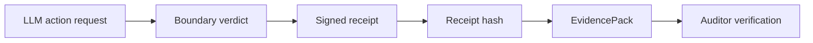

# Signed Receipts for AI Agent Actions

Logs answer "what did we write down"; receipts answer "what actually happened,
and can someone else check?" HELM AI Kernel signs every boundary decision with
Ed25519 over a JCS (RFC 8785) canonical form. **Status: Live** in HELM AI
Kernel.

Receipts roll up into EvidencePacks: content-addressed, SHA-256-hashed archives
that bundle the decision chain for a run.

The norm this enables is simple: no receipt, no production. An agent action that
cannot be replayed and verified did not happen as far as your audit trail is
concerned.

## What the signature covers

The `receipt.v5` signing envelope is a fixed 13-key JCS object
(`core/pkg/crypto/canonical.go:169-183`): `signature_version`, plus
`receipt_id`, `decision_id`, `effect_id`, `status`, `output_hash`, `prev_hash`,
`lamport_clock`, `args_hash`, `verdict`, `reason_code`, `policy_hash` and
`session_id`.

`contracts.Receipt` carries 76 JSON fields
(`core/pkg/contracts/receipt.go:9-116`). Twelve receipt fields plus the version
tag are inside the signature. The rest are not, and editing one of them does not
invalidate the signature. `timestamp`, `executor_id`, `correlation_id`,
`metadata`, `key_id`, `public_key_set`, `merkle_root`, `witness_signatures`,
`model_hash`, `tool_name` and `risk_tier` are all carried unsigned —
`correlation_id` says so in its own struct comment: treat it as *a recorded
claim, not signed evidence* (`core/pkg/contracts/receipt.go:15-16`).

So state the guarantee precisely, because the precise version is the one worth
having: **the governance meaning of a receipt — its verdict, reason code, policy
hash, session, and the hashes binding the arguments and output — cannot be
rewritten without invalidating the signature.** Per
[ADR 0002](../adr/0002-canonical-receipt-bytes.md) (amended 2026-08-06) and
[ADR 0003 §D5](../adr/0003-normative-artifact-arbitration.md), no document may
call a HELM receipt tamper-evident without naming the fields it covers.

Two limits apply today:

- **Chaining covers backwards, not forwards.** `prev_hash` is signed and is a
  hash of the whole preceding receipt, so altering any field of a receipt that
  has a successor breaks the successor's chain check. The last receipt in a
  chain has no successor and gets no such cover.
- **Unversioned receipts verify under a narrower rule.** A receipt with no
  `signature_version` falls back to the legacy V4 preimage: eight fields joined
  with `:` (`core/pkg/crypto/canonical.go:232-233`). The 13-key envelope applies
  only to receipts that declare `receipt.v5`.

## Verifying a pack

`receipt_verify` checks a receipt chain with no HELM service in the trust path.
It opens no sockets by construction rather than by policy: the binary's
transitive import graph contains no transport package, and a test fails the
build if one appears (`core/cmd/receipt_verify/main.go:1-32`).
**Status: Live.**

Verification answers one question — were these bytes signed by the key you
supplied. It does not bind that key to an organization, so an auditor, insurer,
or counterparty needs the signer's public key over an independent channel.
Running with `--allow-self-attested` verifies against a key that travelled
inside the pack; that shows internal consistency and nothing about origin.

The byte-construction rule for the mainline receipt is **not yet published**, so
a third party cannot currently write an independent verifier from a
specification — they run this one. The mainline receipt is recorded as
integrity-UNSPECIFIED in
[ADR 0003 §D4](../adr/0003-normative-artifact-arbitration.md), and publishing
the specification is tracked as remediation step P2-3. **Status: coming soon.**

## Audit Receipt Chain


```mermaid
flowchart LR
    Request["LLM action request"] --> Verdict["Boundary verdict"]
    Verdict --> Receipt["Signed receipt"]
    Receipt --> Hash["Receipt hash"]
    Hash --> EvidencePack["EvidencePack"]
    EvidencePack --> Auditor["Auditor verification"]
```

```bash
git clone https://github.com/Mindburn-Labs/helm-ai-kernel.git
cd helm-ai-kernel
make build
bash scripts/launch/demo-proof.sh
```

## Source Truth

- [Quickstart](../QUICKSTART.md)
- [Execution security model](../EXECUTION_SECURITY_MODEL.md)
- [MCP integration](../INTEGRATIONS/mcp.md)
- [Verification](../VERIFICATION.md)
- [ADR 0002 — canonical receipt bytes](../adr/0002-canonical-receipt-bytes.md)
- [ADR 0003 — normative artifact arbitration](../adr/0003-normative-artifact-arbitration.md)
