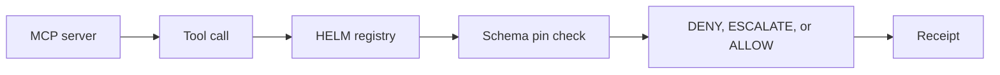

# MCP Tool Quarantine

MCP made it trivial for agents to discover new tools; it also made it trivial for a malicious or drifted server to hand your agent a dangerous one. HELM AI Kernel treats every MCP server as untrusted until a human says otherwise.

Discovered servers enter a quarantine lifecycle: discovered, quarantined, then approved, revoked, or expired. While quarantined, their tools cannot dispatch; calls return a deterministic verdict instead of reaching the tool. Approved tools are pinned to their schema, so a server that silently changes a tool's contract trips the pin check and falls back to deny.

Every decision along that path produces a signed receipt, which means you can show an auditor exactly which MCP tools were reachable, when each was approved, and by whom. This is the fail-closed security layer the MCP ecosystem is missing.

## MCP Firewall Path



```bash
git clone https://github.com/Mindburn-Labs/helm-ai-kernel.git
cd helm-ai-kernel
make build
bash scripts/launch/demo-mcp.sh
```

## Source Truth

- [Quickstart](../QUICKSTART.md)
- [Execution security model](../EXECUTION_SECURITY_MODEL.md)
- [MCP integration](../INTEGRATIONS/mcp.md)
- [Verification](../VERIFICATION.md)
