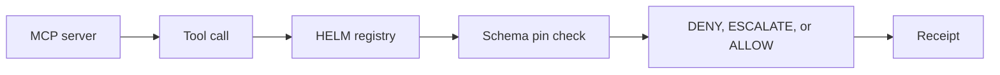

# MCP Tool Quarantine

HELM AI Kernel documents this search intent with a local, source-backed proof path.

## MCP Firewall Path



```bash
git clone https://github.com/Mindburn-Labs/helm-ai-kernel.git
cd helm-ai-kernel
make build
bash scripts/launch/demo-mcp.sh
```

## Source-Backed Docs

- [Quickstart](../QUICKSTART.md)
- [Execution security model](../EXECUTION_SECURITY_MODEL.md)
- [MCP integration](../INTEGRATIONS/mcp.md)
- [Verification](../VERIFICATION.md)
