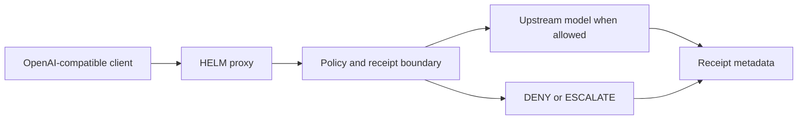

# OpenAI-Compatible Execution Boundary

If your applications already speak the OpenAI chat-completions API, you can put a policy boundary in front of them without changing a line of client code. HELM AI Kernel ships a proxy that accepts OpenAI-compatible requests, evaluates them against your policy, and only then forwards to the upstream model.

Requests that violate policy never reach the provider: they return a DENY or ESCALATE verdict instead, and the decision is recorded as a signed receipt either way. Allowed traffic flows through with receipt metadata attached, so every model call in your fleet becomes attributable and replayable.

Start it with one command (`make proxy` in the repository, or the demo script below), point your existing client's base URL at it, and watch the receipt stream record what your agents actually ask for.

## Gateway Policy Path



```bash
git clone https://github.com/Mindburn-Labs/helm-ai-kernel.git
cd helm-ai-kernel
make build
bash scripts/launch/demo-openai-proxy.sh
```

## Source Truth

- [Quickstart](../QUICKSTART.md)
- [Execution security model](../EXECUTION_SECURITY_MODEL.md)
- [MCP integration](../INTEGRATIONS/mcp.md)
- [Verification](../VERIFICATION.md)
