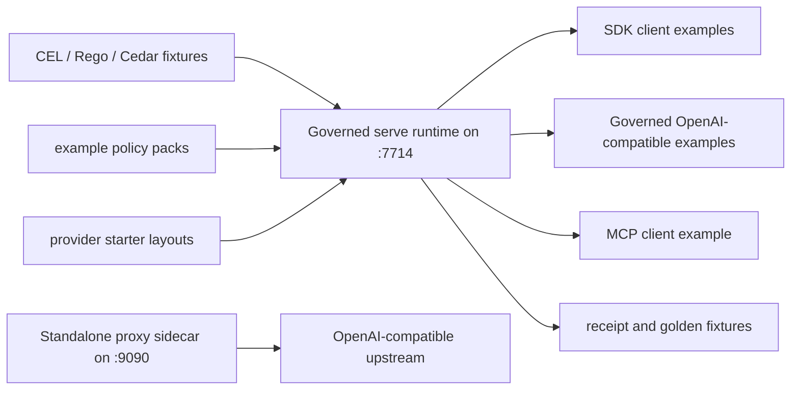

# Examples

The retained examples are small entry points for the OSS kernel, SDKs,
OpenAI-compatible proxy, policy fixtures, policy-pack examples, telemetry, and
provider starter layouts. A path is documented as runnable only when this
directory contains the script or source file needed to run it.

## Example Topology



## Before Running Networked Examples

Most client examples expect the governed `serve` runtime at
`http://127.0.0.1:7714`.

```bash
make build
./bin/helm-ai-kernel serve --policy ./release.high_risk.v3.toml
```

Or run the binary directly with an explicit port:

```bash
./bin/helm-ai-kernel serve --policy ./release.high_risk.v3.toml --addr 127.0.0.1 --port 7714
```

Examples that invoke governed chat also require an admin bearer key and
matching tenant, principal, and session bindings. They need
`HELM_UPSTREAM_URL` and the separate server-owned
`HELM_UPSTREAM_API_KEY` to reach a model provider; the latter must never reuse
the runtime admin bearer. See each example README for the complete setup. The
standalone `helm-ai-kernel proxy` sidecar on `:9090` is a different integration surface and is documented in
[`docs/INTEGRATIONS/openai_baseurl.md`](../docs/INTEGRATIONS/openai_baseurl.md).

## SDK Examples

| Path | Purpose | Validation status |
| --- | --- |
| `python_sdk/` | First-class Python SDK example covering ALLOW, DENY, MCP fail-closed denial, receipt verification, sandbox preflight, and evidence verification | `make sdk-examples-smoke` |
| `ts_sdk/` | First-class TypeScript SDK example covering ALLOW, DENY, MCP fail-closed denial, receipt verification, sandbox preflight, and evidence verification | `make sdk-examples-smoke` |
| `go_client/` | Go SDK source example using `sdk/go/client` | `go test ./examples/go_client/... -run '^$'` |
| `java_client/` | Java SDK source example using `sdk/java` | Requires `cd sdk/java && mvn -q test package` before compiling `Main.java`. |
| `rust_client/` | Rust SDK source example using `sdk/rust` | Source example; the SDK itself is validated by `make test-sdk-rust`. |

## Governed OpenAI-compatible Examples

| Path | Purpose | Run |
| --- | --- |
| `js_openai_baseurl/` | JavaScript `fetch` client for the governed chat route | `cd examples/js_openai_baseurl && node main.js` |
| `python_openai_baseurl/` | Python SDK client for the governed chat route | `cd examples/python_openai_baseurl && python main.py` |
| `ts_openai_baseurl/` | TypeScript SDK client for the governed chat route | `cd examples/ts_openai_baseurl && npx tsx main.ts` |

## Verification Examples

| Path | Purpose | Validation |
| --- | --- |
| `golden/` | Small static reference artifacts for documentation and demos | `make verify-fixtures` validates the canonical fixture roots under `fixtures/`; this directory is example material. |
| `mcp_client/` | Simple MCP and OpenAI-compatible invocation flow | `cd examples/mcp_client && HELM_URL=http://127.0.0.1:7714 bash main.sh` |
| `openclaw/` | Browser split-compute runtime-adapter contract | Documentation-only contract example. |
| `otel-genai/` | OpenTelemetry GenAI semantic convention smoke example | `cd examples/otel-genai && go test ./...` |
| `policy-packs/` | Runnable example serve-policy wrappers plus JSON reference packs for shell, destructive operations, DB, CI/CD, and cloud mutation scenarios | `cd core/cmd/helm-ai-kernel && go test . -run TestPolicyPackExamplesLoad -count=1` |
| `policies/` | CEL, Rego, and Cedar policy fixtures | See `examples/policies/README.md`. |
| `receipt_verification/` | Python and TypeScript receipt verification examples | Requires a running HELM boundary with receipts. |
| `starters/` | Provider starter layouts for OpenAI, Anthropic, Google, and Codex profiles | See `examples/starters/README.md`. |

## Claim Rules

- Do not document an example as a supported integration unless it has a source
  path, a README, and a validation command in `docs/developer-coverage.manifest.json`.
- Provider starters are example-only layouts. They do not certify provider SDKs.
- Expected output depends on the running policy, upstream provider, and receipt
  store state; READMEs should describe response shape rather than fixed IDs,
  gate counts, or version strings.
