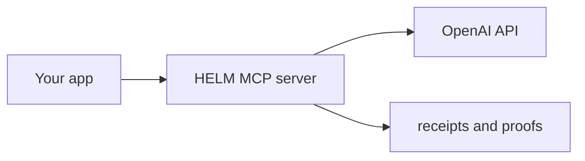

# OpenAI Starter — HELM AI Kernel Governed AI

Get started with HELM AI Kernel governance over OpenAI models in under 5 minutes.

## Prerequisites

- Go 1.24+
- `helm` binary (run `make build` from repo root)
- An OpenAI API key

## Quick Start

```bash
# 1. Initialize a new HELM project with the OpenAI profile
helm-ai-kernel init openai ./my-openai-project

# 2. Set your API key
cd my-openai-project
echo "OPENAI_API_KEY=sk-..." >> .env

# 3. Run the doctor to verify setup
helm-ai-kernel doctor --dir .

# 4. Start the governed MCP server
helm-ai-kernel mcp serve --transport http

# 5. Run your first governed call
./first-governed-call.sh
```

## What's Included

| File | Purpose |
| --- | --- |
| `helm.yaml` | HELM config with OpenAI base-URL proxy pattern |
| `first-governed-call.sh` | Runnable script demonstrating a governed tool call |
| `ci-smoke.sh` | CI-compatible smoke test |

## How It Works

HELM sits between your application and the OpenAI API as a governance proxy:



Every tool call is intercepted by the governance firewall, which evaluates it against
your policy manifest, emits a cryptographic receipt, and forwards to the provider.
