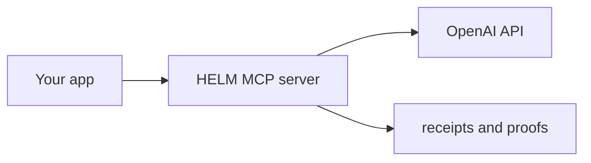

# OpenAI Starter — Local MCP Fixture

This starter creates an OpenAI-profile project, then uses `curl` to initialize
a local MCP session and list its tools. It does not start an OpenAI client,
send a model request, or prove that any arbitrary application path reaches
HELM.

## Prerequisites

- Go 1.24+
- `helm` binary (run `make build` from repo root)
- An OpenAI API key only when you separately configure a real OpenAI client;
  the local fixture below does not call OpenAI.

## Quick Start

```bash
# 1. Initialize a new HELM project with the OpenAI profile
helm-ai-kernel init openai ./my-openai-project

# 2. Set your API key
cd my-openai-project
echo "OPENAI_API_KEY=sk-..." >> .env

# 3. Run the doctor to verify setup
helm-ai-kernel doctor --dir .

# 4. Start the governed MCP server
helm-ai-kernel mcp serve --transport http

# 5. Run the local MCP fixture
./first-governed-call.sh
```

## What's Included

| File | Purpose |
| --- | --- |
| `helm.yaml` | HELM config with OpenAI base-URL proxy pattern |
| `first-governed-call.sh` | Runnable local MCP initialize and tool-list fixture |
| `ci-smoke.sh` | CI-compatible smoke test |

## How It Works

For application calls explicitly routed to its configured OpenAI-compatible
proxy, HELM sits between that application path and the OpenAI API:



Every submitted tool call that reaches the configured governance proxy is
evaluated against its policy manifest, receives a cryptographic receipt, and
may be forwarded to the provider. Direct upstream and unconfigured application
paths remain outside this fixture and boundary.
