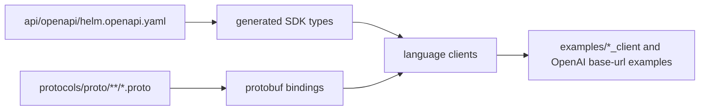

# HELM OSS SDKs

The SDK directory contains the retained public client surfaces for HELM OSS.
Each package wraps the HTTP/OpenAPI boundary and, where present, generated
protobuf message bindings under the language-specific generated directories.

## Source Truth



## SDK Matrix

| Language | Source | Package identity | Readiness | Validation |
| --- | --- | --- | --- | --- |
| Go | `sdk/go/client/` | `github.com/Mindburn-Labs/helm-oss/sdk/go` | Source-backed SDK package | `make test-sdk-go-standalone` |
| Python | `sdk/python/helm_sdk/` | `helm-sdk` | First-class local example under `examples/python_sdk/` | `make test-sdk-py` |
| TypeScript / JavaScript | `sdk/ts/src/` | `@mindburn/helm` | First-class local example under `examples/ts_sdk/` | `make test-sdk-ts` |
| Rust | `sdk/rust/src/` | `helm-sdk` | Source-backed SDK package | `make test-sdk-rust` |
| Java | `sdk/java/src/main/java/` | `com.github.Mindburn-Labs:helm-sdk` | Source-backed SDK package | `make test-sdk-java` |

## What Is Covered

- Chat-completion calls through the OpenAI-compatible HELM boundary.
- Kernel approval, ProofGraph receipt lookup, evidence export, evidence
  verification, replay verification, and conformance routes.
- Execution-boundary helper methods where the language client has source for
  the corresponding OpenAPI route.
- `evaluateDecision` / `evaluate_decision` helpers for the retained
  `/api/v1/evaluate` route.
- TypeScript-only framework adapter helpers for LangGraph, CrewAI, OpenAI
  Agents SDK, PydanticAI, and LlamaIndex tool-call events.

## What Is Not Claimed

- A language package is not documented as published merely because package
  metadata exists. Registry publication must be verified against the retained
  publish workflow or the registry itself.
- Framework adapter helpers are compatibility helpers, not vendor
  certification and not full framework runtimes.
- External evidence envelopes are compatibility wrappers over HELM-native
  EvidencePack roots, not independent authority.

## Regeneration

OpenAPI type generation is owned by `scripts/sdk/gen.sh`. Protobuf generation
is owned by the `make codegen-*` targets in the repository `Makefile`.

Run these gates before publishing SDK claims:

```bash
make sdk-openapi-check
make test-sdk-go-standalone
make test-sdk-py
make test-sdk-ts
make test-sdk-rust
make test-sdk-java
make sdk-examples-smoke
make docs-coverage docs-truth
```
